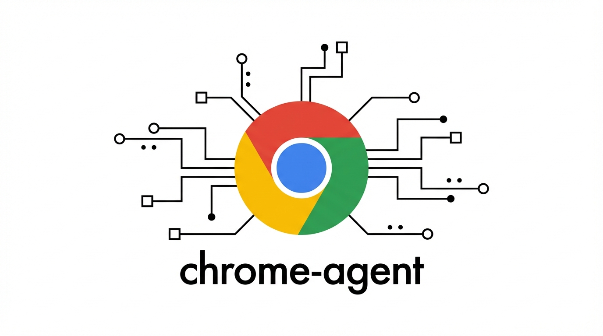

# chrome-agent

[](https://crates.io/crates/chrome-agent)
[](https://www.npmjs.com/package/chrome-agent)
[](https://github.com/sderosiaux/chrome-agent/actions/workflows/ci.yml)
[](LICENSE)
[](https://doc.rust-lang.org/edition-guide/rust-2024/)

<p align="center">
  
</p>

<p align="center">
  <strong>Turn a web page into records your agent can use, from one 3 MB binary.</strong>
</p>

<p align="center">
  <a href="README.md">English</a> | <a href="README.cn.md">简体中文</a>
</p>

> **Disclaimer:** This is an independent, community-driven project. It is not affiliated with, endorsed by, or sponsored by Google or the Chrome team.

> You're not the user. Your LLM is.
>
> You don't need to read this README. Your agent does. Install it, run `chrome-agent --help`, and let the LLM figure it out. The CLI embeds its own usage guide, every error comes with a hint for the next action, and `--json` gives an agent structured data without you writing an adapter. This page is here because GitHub expects one.

## The one thing it does that others don't

Every browser tool can hand a page to a model. The question is what shape it arrives in.

```bash
chrome-agent goto news.ycombinator.com
chrome-agent --json extract --limit 30
```

```json
{"ok":true,"count":30,"pattern":"TR.athing.submission","items":[
  {"title":"PGSimCity - How PostgreSQL Works",
   "url":"https://nikolays.github.io/PGSimCity/",
   "fields":["PGSimCity - How PostgreSQL Works (nikolays.github.io)"]},
  ...
]}
```

No selectors. No model call to find the rows. The pattern is detected structurally, with
MDR/DEPTA-style heuristics that score sibling similarity, content heterogeneity and
text-to-link ratio.

Measured on that page with [`scripts/measure.sh`](scripts/measure.sh), which you can run yourself:

| what you hand the model | tokens | what it gets |
|---|---|---|
| `extract --limit 30` | **1,571** | 30 stories as records, with URLs |
| `inspect` (accessibility tree) | 5,652 | the tree, stories mixed into the surrounding page |
| raw HTML | 8,727 | everything, including markup nobody reads |

All three contain the same 30 stories. Only the first hands them over as records. The
others hand over the page and leave the model to find the stories in it, which you pay for
twice: once in input tokens, again in the reasoning to parse them.

How wide that gap is depends on the page. On a blog archive that is nothing but a list,
`extract` returns ~12,500 tokens against ~16,100 for the tree, because there is little
surrounding markup to strip. The win comes from pages where the records sit inside a lot of other page furniture.

Every rival makes an agent either write per-site selectors, which break on the next deploy,
or pay a model to read the DOM, which is the recurring cost this tooling exists to avoid.

## How is this different from agent-browser?

[agent-browser](https://github.com/vercel-labs/agent-browser) (Vercel) is the closest thing
to this, it is also a Rust CLI built for agents, and it is well ahead: more features, more
users, near-daily releases. If you want a platform, use it. Two honest differences:

| | chrome-agent | agent-browser |
|---|---|---|
| **Repeating-record extraction** | `extract`, structural, no LLM call | not built in; `read` returns readable text |
| **Bot detection** | 7 in-binary CDP patches, `--connect` to real Chrome | no stealth in core; delegated to paid cloud providers |
| **Process model** | one command, one connection, exits | background daemon |
| **Element IDs** | `backendNodeId`, still valid on the next inspect of the same page | sequential `@e1`, reassigned on every snapshot |
| **Browser-native downloads** | not supported, `download --url` only | supported |
| **MCP server** | none | yes |

Where it is genuinely behind: agent-browser has click-triggered downloads, an encrypted
credential vault, cloud provider integrations and an MCP mode. It also reuses your real
Chrome profile, same as `--copy-cookies` here, so logged-in access is not a differentiator
for either of us.

## Why you shouldn't use chrome-agent

Borrowed from [ripgrep](https://github.com/BurntSushi/ripgrep), because the fastest way to
waste your afternoon is a README that only lists strengths.

- **You need a test framework.** Use Playwright. Assertions, retries, trace viewer, a
  test runner, and Microsoft maintaining it.
- **You want a supported product.** This is one person's project. No SLA, no roadmap
  promises, no enterprise support.
- **You need MCP.** There is no MCP server here. If your coding agent can't shell out, this is
  the wrong tool.
- **You need a browser fleet.** No cloud, no proxy pool, no CAPTCHA solving. Browserbase,
  Steel and Browserless do that.
- **Your target is behind DataDome or Kasada.** `--stealth` won't get you through. You'll
  need `--connect` to a real Chrome, and even then, no promises.
- **You need Firefox or Safari.** This speaks CDP. Chrome only.

## What it's built on

- **One binary, zero runtime.** No Node, no npm, no Playwright download. Linux builds are
  static (musl), so they run on any distro without a glibc version to match.
- **Errors are instructions.** Every failure carries a `hint` for the next action:
  `{"ok":false,"error":"...","hint":"run inspect"}`.
- **Stable element IDs.** uids come from Chrome's `backendNodeId`, so `n82` still points at
  the same node on the next inspect. They do change after a navigation, and `diff` will
  tell you when that happened instead of pretending to compare two different pages.
- **Sessions persist.** Chrome stays alive between calls, so a command costs a connection,
  not a browser launch.
- **Parallel agents don't collide.** `--browser agent1`, `--browser agent2`, separate Chrome
  instances and separate session state.

```
chrome-agent (3 MB Rust binary)
    | CDP over WebSocket
    v
Chrome (headless, no Node.js, no runtime)
```

## Install

```bash
# For AI agents -- installs a SKILL.md your agent reads automatically
npx skills add sderosiaux/chrome-agent

# Or just the binary
npm install -g chrome-agent    # prebuilt
npx chrome-agent --help        # no install
cargo install chrome-agent     # from source
```

## Quick start

```bash
# Navigate and see the page
chrome-agent goto https://example.com --inspect

# Click by uid
chrome-agent click n12 --inspect

# Fill a form
chrome-agent fill --uid n20 "user@test.com"

# CSS selectors work too
chrome-agent click --selector "button.submit"
chrome-agent fill --selector "input[name=email]" "hello@test.com"

# Article content (Readability -- like Firefox Reader Mode)
chrome-agent read

# Visible text, scoped and capped
chrome-agent text --selector "main" --truncate 500

# Run JS
chrome-agent eval "document.title"

# Screenshot (returns a file path, not binary)
chrome-agent screenshot
```

## Commands

### Navigation

| Command | What it does |
|---------|------------|
| `goto <url> [--inspect] [--max-depth N] [--header "K: V"]` | Navigate. Auto-prefixes `https://`. `--header` (repeatable) sends extra HTTP headers. |
| `back` | History back. |
| `forward` | History forward. |
| `close [--purge]` | Stop browser. `--purge` deletes cookies/profile. |

### Inspection

| Command | What it does |
|---------|------------|
| `inspect [--verbose] [--max-depth N] [--uid nN] [--filter "role,role"] [--scroll] [--limit N] [--urls] [--max-chars N] [--offset K]` | a11y tree with UIDs. `--scroll --limit` for infinite scroll. `--urls` resolves href on links. `--max-chars`/`--offset` cap and page the output. |
| `diff` | What changed since last inspect. |
| `screenshot [--filename name] [--format jpeg\|png] [--quality N] [--max-width N] [--uid nN\|--selector "css"]` | Screenshot to file. JPEG/quality/max-width shrink it; `--uid`/`--selector` clip to one element. |
| `pdf [--filename name] [--landscape] [--background]` | Print the current page to a PDF file. |
| `tabs` | List open tabs. |

### Interaction

| Command | What it does |
|---------|------------|
| `click <uid> [--inspect]` | Click by uid. Falls back to JS `.click()` when no box model. |
| `click --selector "css" [--inspect]` | Click by CSS selector. |
| `click --xy 100,200` | Click by coordinates. |
| `dblclick <uid> [--inspect]` | Double-click by uid, `--selector`, or `--xy`. |
| `fill --uid <uid> <value> [--inspect]` | Fill input by uid. |
| `fill --selector "css" <value>` | Fill by selector. |
| `fill-form <uid=val>...` | Batch fill. |
| `select --uid <uid> <value>` | Select dropdown option by value or visible text. |
| `select --selector "css" <value>` | Select by CSS selector. |
| `check <uid>` | Ensure checkbox/radio is checked. Idempotent. |
| `uncheck <uid>` | Ensure checkbox/radio is unchecked. Idempotent. |
| `upload --uid <uid> <file>...` | Upload file(s) to a file input. |
| `upload --selector "css" <file>...` | Upload by CSS selector. |
| `drag <from-uid> <to-uid>` | Drag element to another element. |
| `type <text> [--selector "css"]` | Type into focused element. |
| `press <key>` | Enter, Tab, Escape, etc. |
| `scroll <down\|up\|uid>` | Scroll page or element into view. |
| `hover <uid>` | Hover. |
| `wait <text\|url\|selector> <pattern>` | Wait for a condition. |
| `wait network-idle [--idle-ms N] [--timeout N]` | Wait until the network is quiet for `--idle-ms` (default 500). Beats fixed sleeps for SPA/XHR settle. |

### Content extraction

| Command | What it does |
|---------|------------|
| `read [--html] [--truncate N]` | Article extraction via Mozilla Readability. |
| `text [uid] [--selector "css"] [--truncate N]` | Visible text from page or element. |
| `eval <expression> [--selector "css"]` | JS in page context. `el` = matched element. |
| `extract [--selector "css"] [--limit N] [--scroll] [--a11y]` | Auto-detect repeating data. `--a11y` for React SPAs (X.com). |
| `download <url> [--out path] [--timeout N] [--max-bytes N]` | Download a URL fetched in-page, so cookies/auth carry over (login-gated files). Rejects responses over 64 MiB by default. Returns `{path,bytes,mime}`. |

### Monitoring

| Command | What it does |
|---------|------------|
| `network [--filter "pattern"] [--body] [--live N] [--abort "pattern"]` | Network requests and API responses. `--abort` blocks matching requests. |
| `console [--level error] [--clear]` | console.log/warn/error + JS exceptions. |

### Advanced

| Command | What it does |
|---------|------------|
| `frame <selector\|main>` | Switch `eval`/`inspect` into an iframe (or back to main). Persists only within a `pipe`/`batch` process. |
| `batch` | Execute multiple commands from a JSON array on stdin. |
| `pipe` | Persistent JSON stdin/stdout connection. |

## Global flags

```
--browser <name>         Named browser profile (default: "default")
--page <name>            Named tab (default: "default")
--connect [url]          Attach to a running Chrome
--proxy-server <url>     Proxy a managed Chrome (http(s), socks4/5; explicit port required)
--headed                 Show browser window (default: headless)
--stealth                Anti-detection patches (Cloudflare, Turnstile)
--copy-cookies           Use cookies from your real Chrome profile
--timeout <seconds>      Command timeout (default: 30)
--max-depth <N>          Limit inspect depth
--verdict <mode>         auto (default): an action reports what changed. off: report the action only
--budget <chars>         Cap that change report (default 1200; 0 = uncapped)
--ignore-https-errors    Accept self-signed certs
--json                   Structured JSON output
--dialog <mode>          JS dialog policy: accept (default), dismiss, or manual
--dialog-text <text>     Text to submit for prompt() dialogs when --dialog accept
```

`--proxy-server` is launch-only and is persisted with the named browser session. Close or purge a
running named browser before changing its proxy. Attached browsers (`--connect`) must be configured
with their proxy before ChromeAgent attaches. Proxy URLs containing credentials are rejected.

JS dialogs (`alert`/`confirm`/`prompt`/`beforeunload`) are auto-answered by default (`--dialog accept`). A native dialog otherwise blocks the page with no DOM signal and the agent's next command hangs. Use `--dialog dismiss` to cancel them, or `--dialog manual` to opt out.

## The loop: inspect, act

```bash
chrome-agent goto https://app.com/login --inspect
# uid=n52 textbox "Email" focusable
# uid=n58 textbox "Password" focusable
# uid=n63 button "Sign In" focusable

chrome-agent fill --uid n52 "user@test.com"
# ~ uid=n52 textbox "Email" focusable value="" -> value="user@test.com"

chrome-agent fill --uid n58 "password123"
chrome-agent click n63
# Page navigated — previous uids are gone. New page:
# uid=n101 heading "Dashboard" level=1
```

An action says what it changed, so there is no second call to find out whether it landed.
That is the whole point: an agent loop pays for turns, not just for tokens.

UIDs stay the same between inspects as long as the DOM node exists. After a navigation they
are all reassigned, which is why the click above reports the page rather than a diff.

Every mutating action carries a `verdict` and a `verdict_reason`, so an empty report is never
ambiguous: `changed`, `navigated`, `no_delta` (the tree was identical in the observation
window), `unknown` (no baseline, or the read-back failed — `verdict_hint` says what to do), and
`not_checked` (you switched the report off). `no_delta` is deliberately not called "no effect":
without proof the action was delivered, an unchanged tree cannot tell a quiet page from a click
that hit an overlay.

`--verdict off` restores the older behaviour: the action is reported, the page is not read
back. Faster, quieter, and you find out what happened on your next call — the response says
`not_checked` so you know that is what happened.

## Content extraction

From least to most tokens:

```bash
# Articles (Readability, like Firefox Reader Mode)
chrome-agent read

# Repeating data -- products, search results, feeds. No selectors.
chrome-agent extract
# Uses MDR/DEPTA heuristics. Finds the pattern automatically.

# React SPAs (X.com, etc.) -- uses a11y tree instead of DOM
chrome-agent extract --a11y --scroll --limit 20

# Scoped visible text
chrome-agent text --selector "[role=main]" --truncate 1000

# API responses -- skip the DOM
chrome-agent network --filter "api" --body
```

## Forms: dropdowns, checkboxes, file uploads

```bash
# Select dropdown by value or visible text
chrome-agent select --uid n15 "California"

# Idempotent checkbox control
chrome-agent check n20     # no-op if already checked
chrome-agent uncheck n20   # no-op if already unchecked

# File upload
chrome-agent upload --uid n30 /path/to/document.pdf

# Double-click (text selection, special controls)
chrome-agent dblclick n42
```

## Iframes

The `frame` switch binds `eval` and `inspect` to the iframe, but **only within one process**, so drive it through `pipe` (or `batch`), never as separate CLI calls:

```bash
printf '%s\n' \
  '{"cmd":"frame","target":"#payment-iframe"}' \
  '{"cmd":"inspect"}' \
  '{"cmd":"fill","uid":"n42","value":"4242424242424242"}' \
  '{"cmd":"frame","target":"main"}' | chrome-agent pipe
```

- Target the intended iframe precisely (e.g. `iframe[src*="checkout"]`); a bare `iframe` matches the first one in DOM order, often an ad `about:blank` slot.
- `frame` scopes `eval`/`inspect`; it does **not** scope `--selector` targeting. Run `inspect` after the switch to get iframe uids, then act by uid (uids resolve across frames).
- Each standalone `chrome-agent <cmd>` opens a fresh connection, so `chrome-agent frame …` followed by a separate `chrome-agent inspect` loses the switch. Use `pipe`/`batch`.

## Batch mode

Execute a sequence of commands from stdin without per-command process startup:

```bash
echo '[
  {"cmd":"goto","url":"https://example.com"},
  {"cmd":"inspect","filter":"button"},
  {"cmd":"click","uid":"n42"}
]' | chrome-agent batch
```

Each command produces one JSON line. About 10x faster than spawning a process per command.

## Stealth

`--stealth` patches 7 automation fingerprints via CDP:

- `navigator.webdriver` set to `undefined`
- `chrome.runtime` mocked
- Permissions API fixed
- WebGL renderer masked
- User-Agent cleaned
- Input coordinate leak patched
- `Runtime.enable` never called

These are CDP-level patches (`Page.addScriptToEvaluateOnNewDocument`), not Chrome flags.

For sites with heavier protection (DataDome, Kasada) that fingerprint the Chromium binary itself, connect to your real Chrome:

```bash
google-chrome --remote-debugging-port=9222 &
chrome-agent --connect http://127.0.0.1:9222 goto https://www.leboncoin.fr --inspect
```

| Protection | Solution |
|---|---|
| None | `chrome-agent goto ...` |
| Cloudflare/Turnstile | `chrome-agent --stealth goto ...` |
| Logged-in sites | `chrome-agent --stealth --copy-cookies goto ...` |
| DataDome/Kasada | `chrome-agent --connect` to real Chrome |

## Logged-in sites

`--copy-cookies` copies the cookie database from your Chrome profile. Both Chrome instances use the same macOS Keychain, so encrypted cookies just work.

```bash
chrome-agent --stealth --copy-cookies goto x.com/home --inspect
# Your timeline. Your DMs. No login flow.

chrome-agent --copy-cookies goto mail.google.com --inspect
chrome-agent --copy-cookies goto github.com/notifications --inspect
```

Your real Chrome is not affected.

## Network capture and blocking

```bash
# Resources already loaded (stealth-safe, uses Performance API)
chrome-agent network --filter "api"

# Live traffic with response bodies
chrome-agent network --live 5 --body --filter "graphql"

# Block tracking/ads (uses Fetch domain interception)
chrome-agent network --abort "*tracking*" --live 30

# Console output
chrome-agent console --level error    # errors + exceptions only
```

Console capture uses an injected interceptor, not `Runtime.enable`.

## Downloads, PDF, and token-safe screenshots

Files are written under `~/.chrome-agent/tmp` (or your `--out` path) with `0600` perms; the path is printed on stdout. Binary bytes never hit stdout.

```bash
# Download a file, fetched inside the page so cookies/auth carry over.
# Ideal for login-gated exports (invoices, CSVs, PDFs behind an auth wall).
chrome-agent download https://app.com/reports/2024.csv --out ./2024.csv
# {"ok":true,"path":"./2024.csv","bytes":48213,"mime":"text/csv"}

# Print the current page to PDF.
chrome-agent pdf --filename invoice.pdf --background

# Screenshots that don't blow up your context window.
chrome-agent screenshot --format jpeg --quality 60 --max-width 1024
chrome-agent screenshot --uid n42            # capture a single element (or --selector "css")
```

`download` uses an in-page `fetch` with `credentials:'include'`, so the request inherits the page's session. Click-triggered browser-native downloads are not handled: resolve the target href (`inspect --urls`) and download it directly.

## Waiting for the network to settle

```bash
# Resolve once no requests are in flight for 500ms (tunable), bounded by --timeout.
# Replaces fragile fixed sleeps on SPAs / XHR-heavy pages.
chrome-agent wait network-idle
chrome-agent wait network-idle --idle-ms 800 --timeout 20
```

Opt-in (enables the Network domain), so it stays off the stealth hot path.

## Pipe mode

For agents that send many commands in sequence, pipe mode keeps a single connection open:

```bash
echo '{"cmd":"goto","url":"https://example.com","inspect":true}
{"cmd":"click","uid":"n12","inspect":true}
{"cmd":"read"}' | chrome-agent pipe
```

One JSON line per response. About 10x faster than spawning a process per command.

## JSON mode

```bash
chrome-agent --json goto https://example.com --inspect
# {"ok":true,"url":"...","title":"...","snapshot":"uid=n1 heading..."}

chrome-agent --json eval "1+1"
# {"ok":true,"result":2}

# Errors exit 1 but JSON is still on stdout (parseable):
chrome-agent --json click n99
# {"ok":false,"error":"Element uid=n99 not found.","hint":"Run 'chrome-agent inspect'"}
```

## Inspect with link URLs

When deciding which link to click, the agent often needs the URL, not just the text:

```bash
chrome-agent inspect --urls --filter link
# uid=n82 link "Pricing" url="https://example.com/pricing"
# uid=n97 link "Docs" url="https://docs.example.com"
```

## Multi-tab and parallel agents

```bash
# Multiple tabs in one browser
chrome-agent --page main goto https://app.com
chrome-agent --page docs goto https://docs.app.com
chrome-agent --page main eval "document.title"   # "App"

# Multiple agents, each with their own Chrome
chrome-agent --browser agent1 goto https://example.com
chrome-agent --browser agent2 goto https://other.com
```

## Using with AI agents

```bash
# Install the skill (Claude Code, Cursor, Copilot, etc.)
npx skills add sderosiaux/chrome-agent

# Or tell your agent to run:
chrome-agent --help
# The help output includes a full LLM usage guide.
```

Claude Code permissions:

```json
{
  "permissions": {
    "allow": ["Bash(chrome-agent *)"]
  }
}
```

## Comparison

|  | chrome-agent | agent-browser (Vercel) | Playwright MCP |
|---|---|---|---|
| Language | Rust | Rust | TypeScript |
| Binary | 3 MB, zero runtime | 3 MB CLI + dashboard + cloud providers | Node + Playwright |
| Startup | ~10ms (session reuse) | daemon (fast after first) | cold start |
| Page cost, HN front page | 5,652 tokens (`inspect`), 1,571 (`extract`, all 30 records) | not measured here | not measured here |
| UID stability | `backendNodeId` (stable across inspects) | sequential `@e1, @e2` (reassigned per snapshot) | N/A (selectors) |
| Action + observe | `--inspect` flag (1 call) | separate snapshot call | separate call |
| Stealth | 7 native CDP patches | delegated to cloud providers | none |
| Reader mode | `read` (Readability.js) | none | none |
| Data extraction | `extract` (auto-detect repeating data) | none | none |
| Link URL resolution | `inspect --urls` | `snapshot -u` | N/A |
| Dropdowns | `select` | `select` | via selectors |
| Checkboxes | `check`/`uncheck` (idempotent) | `check`/`uncheck` | via selectors |
| File upload | `upload` | `upload` | via selectors |
| Drag and drop | `drag` | `drag` | via selectors |
| Annotated screenshots | not yet | `screenshot --annotate` | not yet |
| Element/token-safe screenshots | `screenshot --uid/--selector`, `--format jpeg`, `--max-width` | via options | via options |
| PDF export | `pdf` (`Page.printToPDF`) | none | none |
| File download | `download` (in-page fetch, auth-preserving) | `download` | via events |
| Extra request headers | `goto --header` | yes | via context |
| Network-idle wait | `wait network-idle` | yes | `browser_wait_for` |
| JS dialog handling | auto (`--dialog accept/dismiss/manual`) | yes | `browser_handle_dialog` |
| Live dashboard | no (lean) | yes (Next.js) | no |
| Cloud providers | no (`--connect` to anything) | 5 built-in | no |
| iOS/Safari | no | yes (WebDriver) | no |
| Network blocking | `network --abort` | `network route --abort` | no |
| Iframe switching | `frame` | `frame` | via selectors |
| Batch execution | `batch` (JSON stdin) | `batch` (JSON or quoted) | N/A |
| AI chat built-in | no (the agent IS the LLM) | yes (AI Gateway) | N/A |
| Codebase | ~10.2K lines | ~40K lines | Playwright |
| Design goal | minimal tokens, maximal autonomy | feature-complete platform | browser testing |

## License

MIT
