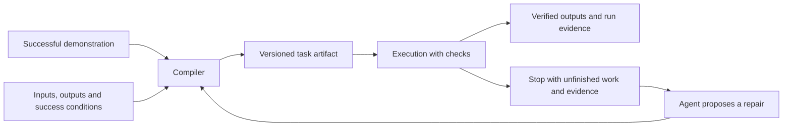

# Web tasks that compile

Exploration against commit `340c34b`, 2026-09-13. This is a proposal, not a description of shipped
`task` commands. Browser probes used the current debug binary and Chrome 152.0.7977.84 on macOS.
Production code was not changed during this investigation.

Strengthen the existing execution protocol and evaluate reusable scripts before committing to
a new task language. Reusable browser functions with checked outcomes remain the proposed
direction. A dedicated compiler is one possible implementation, and the findings below do not
yet establish that it is necessary.

## Decision from first principles

The user needs the requested result, an accurate account of uncertainty, and an acceptable cost
of getting it. Repetition adds a reason to reuse work. None of those needs directly requires a
compiler, a JSON workflow language or automatic repair.

Separate the sources of failure. The task may target the wrong result or account. Its procedure
may no longer fit the page. An action may fail to land, or its effect may remain unknown. Static
validation catches malformed programs; runtime observations establish what happened; explicit
outcome checks connect those observations to the request. Each addresses a different problem.

The earlier proposal moved too quickly from gaps in macros to a general task platform. Those
gaps justify fixes, but cannot decide the architecture. A normal program driving `pipe` can
already express arguments, conditions, iteration, data dependencies and return values. A new
task language would need to justify maintaining those facilities again.

The minimum useful product is an execution layer that reports what it attempted, what it
observed, which declared conditions held and what remains uncertain. The caller supplies the
intent. For repeated work, reuse a procedure while checking the conditions under which it applies.
The browser and its outputs remain dynamic even when the procedure is fixed.

| Approach | What it contributes | What would justify choosing it |
|---|---|---|
| Agent deciding each next step | Adaptation to an unfamiliar page | The path is new or requires judgment; reuse has little value. |
| Ordinary script driving `pipe` | Parameters, branches, loops and outputs using an existing language | The procedure can be written down and the agent can maintain the script. This is the baseline to beat. |
| Existing macros with validation and complete recording | A compact, inspectable procedure without a language runtime | The task is mostly a straight-line sequence and authors benefit from recording it. |
| Dedicated compiled task format | Shared validation, portability and controlled execution across callers | Real workflows repeatedly need guarantees or tooling that scripts and the smaller macro format cannot provide economically. |

Use total cost per correct completion to compare them: discovery and authoring, replay,
verification, repair, plus the consequences of incorrect or duplicated actions. Compilation
earns its place only when reuse savings exceed authoring and maintenance costs at the observed
execution frequency. No reuse frequency or customer demand has been measured here.

The immediate recommendation is A1/A2 below, followed by a complete workflow implemented through
the existing protocol. Compare an agent-driven run with a reusable script, including changed
inputs and page failures. Introduce shared primitives only where the experiment shows repeated
verification or recovery logic. Keep the larger task format and automatic repair as candidates.

## Implemented first increment

The existing macro format now has a shared offline preparation path, exposed through `macro
check` and used by `macro run` before opening Chrome. It validates every command, binding and
guard; string substitution preserves parameter data and also applies to guards.

Recording keeps waits, explicit assertions, reads, downloads and supported context commands.
Failed or undelivered steps, negative read-backs and unsupported locators make the recording
incomplete, so it cannot replace a working macro. Composite forms, batch and drag still need
explicit recordable steps. Successful downloads get a `downloaded: true` guard.

Replay reports retain command outputs and stopped-step evidence, with declared secret inputs
redacted. A failed explicit assertion exits 2. Assertions and waits count as checks; other
steps without a guard remain visible as unguarded.

Chrome integration fixtures cover delayed cart updates, item/variant/quantity assertions,
preexisting items, wrong-item failures, and news extraction with dates, links, sponsored-content
filtering and separate homepage/chronological order. These checks are authored by the caller.
They do not infer arbitrary site semantics or establish portability across sites.

The findings below describe the baseline that motivated these changes. The larger compiler
proposal remains deferred.

## What exists

The next workflow experiment is implemented in
[`examples/report_export`](../../examples/report_export/README.md): a Python program using `pipe`
against a local reference application. Account and period are inputs. The task checks page
context, waits for the scoped report, downloads once, validates the CSV's scope, row count and
total, then publishes the file. Tests compare actual invoice IDs and export counts with an
independent server oracle. Wrong files remain unpublished; response loss produces uncertainty
without another export.

This workflow required no new browser primitive or task format. Input validation, data
dependencies and result assembly fit in the caller's language. The main reusable caller code is
JSONL transport handling, including terminal failures and deadlines. Cross-site adaptation and
discovery-cost comparisons remain unmeasured.

Assertions now accept `--within N` (`"within":N` in pipe and macros) to observe a condition for
up to N seconds. They reuse existing readers and return the first held comparison, or the last
comparison when the window expires. Read failures retain their separate error outcome. This
implements the bounded observation primitive in A7; it adds no task format or action retry.

The action layer reports delivery, retained values, navigation, uncertainty and next actions.
The pipe protocol has typed command objects and cross-field validation. Assertions can check
values, text, URLs and state. These are useful building blocks for a task runner.

Macros already turn a recording into a named JSON artifact, replace some uid targets with
role/name locators, parameterize secret fields, and stop when a guard fails. They use the same
dispatcher as pipe and batch. These choices should carry forward.

The [macro rules](../../.claude/rules/macros.md) explicitly describe the present boundary:
there is no repair, retry or branch. That is an intentional constraint. Adding those features
needs an execution model that accounts for actions already performed.

## Findings reproduced before implementation (`340c34b`)

| Probe | Observed behavior | Consequence for task compilation |
|---|---|---|
| Record `goto → fill → wait → assert → text → download` | The saved macro contains only `goto → fill`. The record report lists the other four commands as dropped. | A reusable task loses its synchronization, success check, data and file output. |
| Fill `#ctrl` in `form_value_controlled_revert.html` | The response is `ok:true`, `verdict:not_kept`, `next:stop`, `verbatim:false`. The recorder saves `expect.verdict = not_kept`. Replaying exits 0 with `ok:true` and zero unguarded steps. | Every guard can hold while the requested value is still absent. |
| Macro with a valid fill followed by `typo_command` | The fill changes the field to `already-mutated`; only then does the run reject the unknown command. | A statically invalid task can partially execute. |
| Macro with a valid fill followed by an undeclared `{{missing}}` reference | The first fill happens. Substitution later fails with a generic error that omits the completed-step report. | Invalid bindings are discovered after mutation, and the caller loses the progress context. |
| Bind a value ending in a double quote | `--var 'value=ends-in-quote"'` fails with `EOF while parsing a string`. | Parameters are not yet reliable function arguments. |

These are demonstrations of capability gaps, not a measurement of how often real sites fail.
The probes used existing local fixtures, unique browser/macro names and temporary recordings;
their browsers and macro files were removed afterward.

The implementation explains the results:

- [Step selection](https://github.com/sderosiaux/chrome-agent/blob/340c34b/src/macros_record.rs#L132)
  reuses `mutates_page`. That predicate answers whether to attach a change report, not whether
  a command belongs in a task. It excludes `download` even when the download clicks a control.
- [Guard derivation](https://github.com/sderosiaux/chrome-agent/blob/340c34b/src/macros_record.rs#L327)
  preserves verdict words other than `unknown` and `not_checked`, including `not_kept`.
- [Macro parsing](https://github.com/sderosiaux/chrome-agent/blob/340c34b/src/macros.rs#L179)
  validates the outer structure, name and nonempty steps. Individual actions remain raw JSON.
  [The runner](https://github.com/sderosiaux/chrome-agent/blob/340c34b/src/macros_run.rs#L130)
  resolves and dispatches them one at a time.
- [Substitution](https://github.com/sderosiaux/chrome-agent/blob/340c34b/src/macros.rs#L255)
  serializes the action and performs string replacement. Removing surrounding quote characters
  with `trim_matches` also removes a trailing escaped quote from the replacement.

A handwritten macro can already execute supported waits, assertions and downloads. The recording
pipeline drops them; they are not all missing from the runner. Likewise, `text_contains` and
`exists` guards already exist, but are not inferred by the recorder.

Source inspection also shows that general business inputs are not inferred: the
[parameterizer](https://github.com/sderosiaux/chrome-agent/blob/340c34b/src/macros_record.rs#L281)
leaves non-secret values literal. The
[success report](https://github.com/sderosiaux/chrome-agent/blob/340c34b/src/macros_run.rs#L182)
returns step and guard summaries, without named task outputs. These limit reuse even when the
recorded actions are correct.

## What a compiler could establish

Compilation should answer everything knowable before contacting a page: whether commands exist,
arguments have valid shapes, referenced inputs exist, outputs have producers, guards can be
parsed, required executor capabilities are understood, and every essential step is represented.

Runtime checks establish what depends on the website: the current account, matching elements,
whether a write held, whether an export finished, and whether the requested result exists.
Actual Chrome and page capability support must also be checked at runtime.
Successful compilation cannot promise that a future version of a website will behave the same.

Use a versioned JSON execution plan initially. Native code generation or bytecode would add little
to these checks. The existing Rust dispatcher is already the executor.



A single demonstration supplies one path. It cannot establish which strings are parameters,
which steps are optional, whether an operation is safe to repeat, or which page change means
the business goal succeeded. Let the agent or author declare those facts. A second demonstration
with different inputs can suggest generalizations, but should still produce a reviewable diff.

## A workflow for the architecture experiment

Use a monthly report export as one candidate complete workflow. Inputs are an account and reporting
period. The runner checks the account, selects the period, requests the export, waits for the
file, verifies the period and expected columns where the file format permits, and returns the
file path with its size and source context.

This exercises the project's existing strengths: logged-in browser sessions, fills, read-back,
assertions and downloads. It also immediately exposes missing data flow and final-result checks.
The task has a useful output that another program can consume. Confirm that it is a recurring
user need before treating it as the product's main use case. Its fit with existing commands is
an implementation advantage, not evidence of demand.

Implement the first version as an ordinary script driving `pipe`, with explicit checks and a
structured return value. This establishes which missing guarantees belong in chrome-agent and
which are adequately handled by the caller's language. Add a draft-record creation experiment
to expose uncertainty after an external write; exports alone cannot test that behavior.

Possible CLI if a separate compiled format proves useful; not implemented or selected yet:

```bash
chrome-agent task compile ./tasks/export-invoices.task.json \
  --recording session.jsonl --out ./tasks/export-invoices.compiled.json
chrome-agent task check ./tasks/export-invoices.compiled.json --inputs inputs.json
chrome-agent task run ./tasks/export-invoices.compiled.json --inputs inputs.json --json
```

The source would declare the input types, account/host requirements, steps, checks, output
bindings and effect policy. Compilation would report which recorded operations were kept,
removed or unsupported, with links back to their recording indices.

An illustrative result shape:

```json
{
  "status": "verified",
  "task": "export-invoices",
  "outputs": {
    "file": "/chosen-output-dir/invoices.csv",
    "account": "example-account",
    "period": "2026-08"
  },
  "evidence": {
    "account_matched": true,
    "period_matched": true,
    "download_completed": true
  }
}
```

Do not claim checks the runner cannot perform. A downloaded file with an unverified reporting
period should carry that limitation, even if its transfer completed. Output-schema validation
checks shape; it does not prove the data belongs to the requested account.

Follow with paginated table extraction returning typed records, then creation of a draft record
with a returned identifier and verified fields. These add bounded iteration, data dependencies
and external-write handling. Avoid making checkout the first public demonstration: an uncertain
submission needs reconciliation before it can be retried.

## Candidate activities and acceptance criteria

A1 and A2 are immediate fixes. The remaining rows describe capabilities to evaluate, not a
commitment to implement each one in a new task language. Some may remain in ordinary scripts.

| Activity | Concrete change | Acceptance evidence |
|---|---|---|
| A1. Validate the whole macro before execution | Add an offline `macro check` and run its validation before opening a browser. Validate every command, locator form, guard, regex and binding. Reuse the typed pipe parser after handling macro locator fields. | A malformed final step fails without the first step changing the page. Diagnostics name the source step and field. |
| A2. Bind parameters as data | Replace serialized-JSON substitution with structural binding. Preserve literal input strings; handle URL, CSS and regex contexts explicitly. Add JSON-file/stdin input alongside `--var`. Resolve guard references too. | Quotes, backslashes, commas and literal braces survive unchanged. Missing references anywhere fail during preflight. Secret values stay out of diagnostics. |
| A3. Preserve complete task behavior | Separate task-step classification from `mutates_page`. Keep explicit waits, assertions, selected reads, downloads and required frame/page context. Make an essential refused step prevent promotion to an executable task. | The six-command probe retains the declared wait, check and outputs. A recording with an unsupported essential operation is marked incomplete. |
| A4. Declare task success | Add a final condition bound to the requested account/record and inputs. Keep action observations as diagnostics. Do not automatically promote `not_kept` or other negative outcomes into proof of a successful task. | The controlled-input probe cannot become a verified successful fill. An intentionally tested rejection is expressible as an explicit expected outcome. |
| A5. Return outputs and connect steps | Bind named results from reads/downloads; validate declared output shapes and allow later steps to consume earlier results. Include file metadata and provenance. | A report task returns the actual file; a lookup can pass a discovered identifier to its next step. Missing output is a task failure even when all actions ran. |
| A6. Locate within task context | Support role/name plus container, frame and named page; require a unique match. Make account and origin checks separate runtime requirements. | Two rows with the same Edit button are disambiguated by the requested record; changed layout is tolerated; changed identity stops the run. |
| A7. Wait on declared postconditions | Add bounded waits for task conditions. Poll reads while the page settles; account for the observation deadline in the report. | A delayed Saved state succeeds inside its deadline. An absent state times out without another submit. |
| A8. Record progress and support safe handoff | Persist a run identifier, artifact version, completed steps, outputs, failed checks and dispatch evidence. Resume only after checking current state and reconciling uncertain external effects. | Lose the connection after a submission. The next run checks whether the record exists or hands off; it does not blindly submit again. |
| A9. Add bounded control flow | Add explicit conditionals and iteration with limits, termination checks and output aggregation. | Extract all pages with a declared maximum; stop on a repeated cursor or unexpected login page. No guessed branch or unbounded loop. |
| A10. Make repair reviewable | Let the surrounding agent propose a locator/step patch against a specific artifact version, with evidence and regression checks. Recompile the result. | A moved button can be repaired without weakening the final check or replaying a completed external write. The patch is visible in a diff. |
| A11. Package tasks for other agents | Keep task files in the repository; include schema version, input/output definitions, required capabilities and discovery metadata. Add `task list --json`/`describe` before adapters. | A fresh agent can choose and call a task without reading its entire recording. A task can run from a repo path without installation into a personal store. |

A1 and A2 are useful fixes within the current macro design. A3 matters when keeping the recorder.
The first script should demonstrate A4 and A5 using explicit assertions and ordinary return
values. A6 and A7 are candidates for shared browser primitives. Implement A8 through A11 in the
runtime only where workflow experiments establish the need.

Keep existing macro files readable. A future `task` interface should use the same executor and
provide an explicit migration path; it should not fork command semantics. A new file format
needs a schema version and documented compatibility behavior.

A task whose requested state already holds may need no mutation at all. Test that case alongside
the recorded path: requiring the same low-level change verdict on both runs can reject a valid
result. A final condition should express the requested state, with separate checks for workflows
that specifically require a new event or record.

## Where runtime design needs care

Role/name targeting already refuses multiple matches. CSS targeting uses `querySelector`, so
a task layer must add a uniqueness check when it promises one target. A CSS selector copied from
one successful run is not evidence of durability. See the current
[locator recorder](https://github.com/sderosiaux/chrome-agent/blob/340c34b/src/macros_record.rs#L244)
and [role/name resolver](https://github.com/sderosiaux/chrome-agent/blob/340c34b/src/macros_run.rs#L346).

The current `site` is metadata, not a guard. URL guards are path-derived patterns, so they do not
establish the account or host. A task should bind those requirements explicitly, while allowing
declared login/redirect origins where needed. The
[format](https://github.com/sderosiaux/chrome-agent/blob/340c34b/src/macros.rs#L119) and
[URL guard derivation](https://github.com/sderosiaux/chrome-agent/blob/340c34b/src/macros_record.rs#L365)
make that distinction visible.

A run identifier only deduplicates work within the runner. It cannot make a website operation
idempotent. If a create request might have completed, use a declared lookup to reconcile the
result, or return uncertainty. Do not infer safety from a click's label, an HTTP method or a
generic error. Even a fill can trigger an autosave.

Recording cleanup also needs an account of effects. An `eval` may mutate the page; a failed
command may already have dispatched; a login navigation may be essential even when a later
navigation succeeded. The current last-navigation start heuristic is printed and overridable,
but a task compiler needs explicit boundaries and dependency checks before deleting such steps.

Arbitrary page JavaScript can remain an escape hatch, with declared inputs, outputs and effects.
Treat it as opaque to static analysis. The compiler should not describe a script it cannot
analyze as pure or safe to repeat.

## Existing alternatives and product position

These are observations from official documentation, checked on 2026-09-13. They are not a
benchmark or an exhaustive feature audit.

| Tool | Relevant documented capability | Implication for this project |
|---|---|---|
| Playwright | Generates code from interactions and selected visibility/text/value assertions; its runtime waits for actionability and supports retrying assertions. [Code generation](https://playwright.dev/docs/codegen), [waiting](https://playwright.dev/docs/actionability). | Recording actions, generating selectors and waiting for readiness are established capabilities. A task needs a useful result contract and an agent-facing failure report. |
| Stagehand | Local caching reuses actions and agent steps across runs; its deterministic-script workflow starts with agent exploration. [Caching](https://docs.stagehand.dev/v3/best-practices/caching), [deterministic scripts](https://docs.stagehand.dev/v3/best-practices/deterministic-agent). | Avoid positioning repeated execution without model inference as sufficient differentiation. |
| Browser Use Cloud | The v3 API exposes task-template script caching with a workspace. Its `autoHeal` option adds model-based output validation and script regeneration. [Session API](https://docs.browser-use.com/cloud/api-v3/sessions/create-session). | Cached execution, output validation and repair are separate design decisions. Make chrome-agent's checks and model involvement explicit. |
| Workflow Use | Describes parameterized workflows with Browser Use fallback, while warning that the project is early and not recommended for production. [Repository](https://github.com/browser-use/workflow-use). | The demonstration-to-workflow direction already has direct competition. Treat maturity and actual behavior as questions to test. |

The opportunity I would test is a local, model-independent execution layer with inspectable
requirements and evidence. Reusable procedures can initially be ordinary scripts. The current
verdict layer is a useful foundation for that. A competitive advantage remains a hypothesis
until the same workflows are measured across tools.

The README currently follows the headline with per-action read-back. That explains an existing
capability, but it leaves the reusable-task promise unstated. Once the first complete task works,
a clearer supporting sentence would be:

> Turn a browser workflow that worked into a reusable task with checked inputs, verified results,
> and a clear handoff when the page changes.

Ship the example beside the claim: a short demonstration, the resulting task file, a second run
with different inputs, and a changed-page run that stops for a specific unmet condition.

## Bound the first release

Keep the execution path local and reuse the existing browser/session code. Let the calling agent
handle discovery and proposed repair. Demonstrate explicit inputs, checks and outputs through
an ordinary program and the existing protocol before adding a new format. Existing schedulers
can invoke the CLI.

Defer a browser fleet, hosted scheduler, task marketplace, visual workflow editor and embedded
model provider layer. Also defer automatic browser-to-HTTP rewrites: a captured request can
depend on transient authentication, page state and side effects that one recording does not
describe. Later, explicitly declared WebMCP or HTTP steps can fit the same task contract.

## Evidence needed before promoting the claim

Use a fixture matrix with an independent oracle for the actual output or server-side record.
Start with report export, paginated extraction and draft creation. Vary input values, delayed
responses, duplicate labels, harmless layout changes, expired login, wrong account, missing
outputs and disconnects after dispatch. Include reruns where the desired state already exists.

Measure:

- Correct task outcomes, including output/account/period agreement with the independent oracle.
- False successes: `verified` returned when the requested result is wrong or absent. The
  controlled-input case must count here even though its recorded guard held.
- Runs completed without model calls, reported alongside correctness and handoff frequency.
- Essential operations omitted during compilation and reasons a recording remained incomplete.
- External operations duplicated after uncertainty, and whether reconciliation caught them.
- End-to-end latency and model usage, separately for discovery, ordinary replay and repair.

Do not reuse pipe's measured 1.5x read-stream improvement as a task-compilation speed claim.
Removing repeated agent reasoning has a different cost profile and needs its own experiment.
A zero-failure fixture run is evidence for those cases, not a guarantee about all websites.

The first milestone is specific: demonstrate an export once, make its period an argument,
reject invalid inputs before acting, then run the procedure for another period and return the
correct file. Break the relevant page condition and require an informative stop. Compare the
ordinary-script implementation with improved macros before deciding whether a new compiler
removes enough caller complexity to justify itself. Keep or revise the headline after that
result; it should describe the behavior that proved useful.
